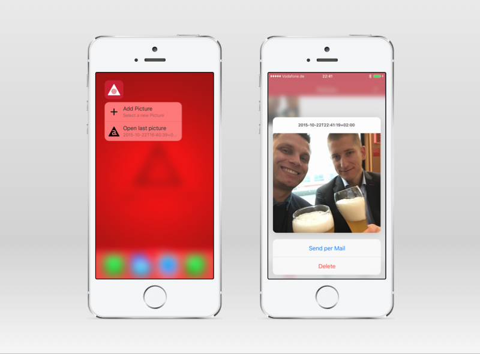
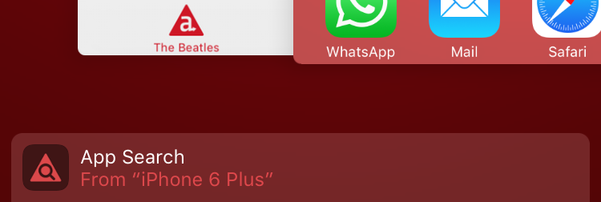

# iOS 9 App Search Sample App

This sample app demonstrates how to make the activities and content of your app searchable via Spotlight, Safari and Siri by using new API's introduced in iOS 9 and supported by Titanium 5.0.0.

## The Big Picture
I highly recommend reading through all of our new [Spotlight Search Guide](http://docs.appcelerator.com/platform/latest/#!/guide/Spotlight_Search) as well as Apple's [App Search Programming Guide](https://developer.apple.com/library/prerelease/ios/documentation/General/Conceptual/AppSearch/index.html) and related documentation but here's the gist of it:

* Use [NSUserActivity](https://developer.apple.com/library/prerelease/ios/documentation/Foundation/Reference/NSUserActivity_Class/index.html) to [Index Activities and Navigation Points](https://developer.apple.com/library/prerelease/ios/documentation/General/Conceptual/AppSearch/Activities.html) on-device and make them available for private search, Siri and [Handoff](https://developer.apple.com/library/prerelease/ios/documentation/UserExperience/Conceptual/Handoff/HandoffFundamentals/HandoffFundamentals.html).
* Use the [Core Spotlight Framework](https://developer.apple.com/library/prerelease/ios/documentation/CoreSpotlight/Reference/CoreSpotlight_Framework/index.html) to [Index App Content](https://developer.apple.com/library/prerelease/ios/documentation/General/Conceptual/AppSearch/AppContent.html) on-device and make it available for private search.
* [Mark Up Web Content](https://developer.apple.com/library/prerelease/ios/documentation/General/Conceptual/AppSearch/WebContent.html) to index content on web pages and make it available for public search.
* Use [Universal Links](https://developer.apple.com/library/prerelease/ios/documentation/General/Conceptual/AppSearch/UniversalLinks.html) and [Smart App Banners](https://developer.apple.com/library/prerelease/ios/documentation/AppleApplications/Reference/SafariWebContent/PromotingAppswithAppBanners/PromotingAppswithAppBanners.html) to enable users to open the current content or activity in your app.
* [Combine APIs](https://developer.apple.com/library/prerelease/ios/documentation/General/Conceptual/AppSearch/CombiningAPIs.html) for NSUserActivity, Core Spotlight and Web Content Mark Up for the same content to increase coverage and [ranking](https://developer.apple.com/library/prerelease/ios/documentation/General/Conceptual/AppSearch/SearchUserExperience.html#//apple_ref/doc/uid/TP40016308-CH11-SW1).

As you can see Apple wants users to seamlessly move between apps (via search), devices (via handoff) as well as between native apps and websites (via Safari search, universal links and handoff). Apple's programming guide has a nice list of [Example Implementations](https://developer.apple.com/library/prerelease/ios/documentation/General/Conceptual/AppSearch/Choosing.html) for different types of apps to give an idea of how this might work for your app.

## The Sample
To show the APIs in action I've created the [iOS App Search Sample App](https://github.com/appcelerator-developer-relations/appc-sample-appsearch).

## Spotlight

The first tab in the sample app shows you a list of The Beatles. The four individual band members will be indexed by SpotLight. The list itself is a user activity, but we'll come back to that later.

> **Quick Tip:** I use a local instance of an [definition-less model/collection](app/models/array.js) which means I can [populate (reset) the collection](app/controllers/list.js#L25) to use Alloy's data-binding on any array of objects.

### Adding items to the Spotlight index
Scroll down to [line 53](app/controllers/list.js#L53) of `app/controllers/list.js` to see how I add the Beatles to the Spotlight index. There are three parts to it:

* [Ti.App.iOS.SearchableItemAttributeSet](http://docs.appcelerator.com/platform/latest/#!/api/Titanium.App.iOS.SearchableItemAttributeSet) to create meta data for a..
* [Ti.App.iOS.SearchableItem](http://docs.appcelerator.com/platform/latest/#!/api/Titanium.App.iOS.SearchableItem) which I add to an instance of..
* [Ti.App.iOS.SearchableIndex](http://docs.appcelerator.com/platform/latest/#!/api/Titanium.App.iOS.SearchableIndex)

The attribute set has a [huge amount of properties](https://developer.apple.com/library/prerelease/ios/documentation/CoreSpotlight/Reference/CSSearchableItemAttributeSet_Class/index.html#//apple_ref/doc/uid/TP40016247-CH1-DontLinkElementID_170) you can use to describe the item. Some let iOS play a song, call a phone number or navigate to an address directly from the Spotlight results without even opening your app.

In short, this is how you'd index a single item:

	var index = Ti.App.iOS.createSearchableIndex();
	
	index.addToDefaultSearchableIndex([
	
		Ti.App.iOS.createSearchableItem({
			uniqueIdentifier: 'my-id',
			domainIdentifier: 'my.content.type',
			attributeSet: Ti.App.iOS.createSearchableItemAttributeSet({
				title: 'My Item'
			})
		})
	
	], function (e) {
		e.success || alert('Oops!');
	});

### Deleting items from the Spotlight  index
Indexed items by default expire after one month unless you have set [Ti.App.iOS.SearchableItem.expirationDate](http://docs.appcelerator.com/platform/latest/#!/api/Titanium.App.iOS.SearchableItem-property-expirationDate). You can also manually delete all items, items with a shared `domainIdentifier` or specific items by `uniqueIdentifier`.

The list in the sample app has a Trash/Add icon as the left navigation button to [delete all items](app/controllers/list.js#L121) for the Beatles domain or re-index them. Search for `appsearch` before and after to verify the change is effective immediately.

	var index = Ti.App.iOS.createSearchableIndex();
	
	index.deleteAllSearchableItemByDomainIdenifiers(['content.type'],
		function (e) {
			e.success || alert('Oops!');
		}
	);

### Opening a Spotlight search result
When a user taps on a Spotlight search result, your app will open and receive the [continueactivity](http://docs.appcelerator.com/platform/latest/#!/api/Titanium.App.iOS-event-continueactivity) event.

Be aware that this event is also fired when a User Activity is opened from the search results or handed off from another device. In the case of a Spotlight search result the event's `activityType` property will be `com.apple.corespotlightitem` and `searchableItemActivityIdentifier` will have the `uniqueIdentifier` you've set on the indexed item.

From [line 141](app/controllers/list.js#L141) you can see how to use this information to navigate your app to the content the user requested. In our case we share an [openDetail()](app/controllers/list.js#L197) helper function with the ListView's `itemclick` listener to look up the model and open the detail window.

In short:

	Ti.App.iOS.addEventListener('continueactivity', function(e) {
		
		// Not for us
		if (e.activityType !== 'com.apple.corespotlightitem') {
			return
		}
		
		var uniqueIdentifier = e.searchableItemActivityIdentifier;
			
		// Navigate to the content
	});

## User Activities

The [NSUserActivity](https://developer.apple.com/library/prerelease/ios/documentation/Foundation/Reference/NSUserActivity_Class/index.html#//apple_ref/occ/cl/NSUserActivity) class introduced in iOS 8 to enable [Handoff](https://developer.apple.com/library/prerelease/ios/documentation/UserExperience/Conceptual/Handoff/HandoffFundamentals/HandoffFundamentals.html) can now also be included in both private and even public search results. The new [Ti.App.iOS.UserActivity](http://docs.appcelerator.com/platform/latest/#!/api/Titanium.App.iOS.UserActivity) API in Titanium 5.0 gives you access to all these features.

### Spotlight vs UserActivity
There's a very subtle difference between indexing for on-device search using Core Spotlight and User Activities. Think of indexing User Actives as tracking the pages users *have* visited, where Core Spotlight allows you to index the actual content that might be on one or more of these pages. We'll come back to how they work together later.

### Managing User Activities
In the app we track two user activities. The first is the activity of viewing the list of Beatles and the other is the activity of viewing a individual Beatle's details.

Both are created in the same way in [list.js from line 233](app/controllers/list.js#L233) and most of [detail.js](app/controllers/detail.js).

As you can see we listen to the `focus` and `blur` events of both windows to create and invalidate (end) the related activity. Once invalidated the activity cannot become current again and must be re-created.

The activity itself is uniquely identified by a reverse-domain `activityType`. The current state of the activity is saved to `userInfo`. In case of the detail window this is where we save the model ID of the Beatle we're viewing. While handoff is enabled by default, we need to set `eligibleForSearch:true` to have Spotlight index the activity.

If you search for *appsearch* you should find the list activity as *The Beatles*.

When you compare lines 73-88 in `list.js` and lines 61-79 in `detail.js` you will see that we can describe both a Spotlight item and a User Activity using the same `Ti.UI.SearchableItemAttributeSet`. In `detail.js` we also set the `relatedUniqueIdentifier` property. This prevents duplicate search results and makes that every time the activity becomes current it will count as a *pageview* for the related Spotlight item and improve its ranking.

### Continue a User Activity from Spotlight or Handoff
From [line 141 of list.js](app/controllers/list.js#L141) you can see we handle a user activity search result in almost the same way as for other Spotlight items. We use the `activityType` to identify it and act accordingly.

The exact same `continueactivity` event is also what handoff will fire so we get that for free! Install the app on two devices and double-tap home to try it out:

## Public Indexing & Web Content
Since the sample is not in the App Store I cannot fully demonstrate [how to combine](https://developer.apple.com/library/prerelease/ios/documentation/General/Conceptual/AppSearch/CombiningAPIs.html#//apple_ref/doc/uid/TP40016308-CH10-SW1) the NSUserActivity and Core Spotlight APIs with Web Content Mark Up and Universal Links. Fortunately, Apple has a [excellent guide](https://developer.apple.com/library/prerelease/ios/documentation/General/Conceptual/AppSearch/WebContent.html) on this topic.

### Linking Web Content
I already showed you how to combine NSUserActivity and Core Spotlight APIs for the same content. In the same way you can link Web Content as well.

1. First, set `Ti.App.iOS.UserActivity.webpageURL` to the related webpage URL and use the same value for the Spotlight item's `uniqueIdentifier` which in turn is linked to the activity via `relatedUniqueIdentifier`.

2. Then set the activity's `eligibleForPublicIndexing:true` as well as the required `requiredUserInfoKeys` property. *Eligible* means that a user activity on its own will never show up in search results. It will [Enhance Your Search Results](https://developer.apple.com/library/prerelease/ios/documentation/General/Conceptual/AppSearch/SearchUserExperience.html#//apple_ref/doc/uid/TP40016308-CH11-SW1) for Web Content by counting as *pageviews* for the related content.

3. Last but not least follow Apple's guide to [Mark Up Web Content](https://developer.apple.com/library/prerelease/ios/documentation/General/Conceptual/AppSearch/WebContent.html) and use the [App Search API Validation Tool](https://search.developer.apple.com/appsearch-validation-tool) to verify if you've set it all up correctly.

Another benefit of setting `webpageURL` is that you can now handoff a user activity to a device (including desktops) that doesn't have the app, in which case it will open the website instead. We will come back to that in a separate Handoff sample.

## Links

* [Appcelerator Spotlight Search Guide](http://docs.appcelerator.com/platform/latest/#!/guide/Spotlight_Search)
* [Apple App Search Programming Guide](https://developer.apple.com/library/prerelease/ios/documentation/General/Conceptual/AppSearch/index.html)

## Known Issues

* [TIMOB-19467:
Ti.App.iOS.SearchableItemAttributeSet.thumbnailURL is not working](https://jira.appcelerator.org/browse/TIMOB-19467)
