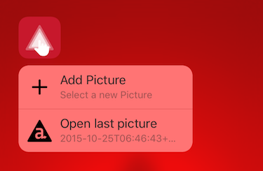

# iOS 9 3D Touch Sample App

This sample app demonstrates the new [3D Touch](http://www.apple.com/iphone-6s/3d-touch/) capabilities of the iPhone 6S. Titanium 5.1 implements [Peek and Pop](https://developer.apple.com/library/ios/documentation/UserExperience/Conceptual/MobileHIG/3DTouch.html#//apple_ref/doc/uid/TP40006556-CH71-SW1) and [Home Screen Quick Actions](https://developer.apple.com/library/ios/documentation/UserExperience/Conceptual/MobileHIG/3DTouch.html#//apple_ref/doc/uid/TP40006556-CH71-SW1). The new [force-properties](https://developer.apple.com/library/ios/documentation/UIKit/Reference/UITouch_Class/index.html#//apple_ref/occ/instp/UITouch/force) available in touch-events will be [added in a later release](https://jira.appcelerator.org/browse/TIMOB-19492) as well as [support for the related Apple Pencil](https://jira.appcelerator.org/browse/TIMOB-19667).

## Force Touch vs 3D Touch
Force Touch was introduced with the [Apple Watch](https://developer.apple.com/watch/human-interface-guidelines/#force-touch) and has later been added to the MacBook and Magic Trackpad for [OS X](https://developer.apple.com/osx/force-touch/). Still, it is two different techniques and 3D Touch is another.

* Apple provides little detail about how Force Touch for Apple Watch exactly works but as a developer it is important that [you do not have direct access to the touch events](https://forums.developer.apple.com/message/5723#5723) and have to implement [Context Menus](https://developer.apple.com/library/ios/documentation/General/Conceptual/WatchKitProgrammingGuide/Menus.html) to which a touch is either *firm* or not. It was even rumored that the Apple Watch measures how the surface of your finger grows as you press with more force.

* The Trackpads however [have four force sensors](http://www.apple.com/macbook/design/) and allow developers to [monitor the exact presure and acceleration](https://developer.apple.com/osx/force-touch/) in OS X.

* The developer experience for 3D Touch on iPhone 6S and 6S Plus is [similar](https://developer.apple.com/ios/3d-touch/) to Force Touch on OS X, but the technique driving it is again different. The screen is now [one big pressure sensor](http://www.apple.com/iphone-6s/3d-touch/) which can measure the exact pressure anywhere.

Why Apple uses two different names for three different techniques is a mistery. We can probably expect the 3D Touch technique to come to Apple Watch 2 and new Trackpacks at which point *Force Touch* would no longer be used.

## Running the Sample
At this moment the iOS Simulator does not let you to simulate 3D Touch events. So to run and test the sample you will need an iPhone 6S to build to.

> **NOTE:** There is a [tweak available](https://github.com/DeskConnect/SBShortcutMenuSimulator) to simulate the Quick Actions in iOS Simulator.

### Via Appcelerator Studio

* Import it via *Dashboard* if available.
* Or import it via *File > Import... > Git > Git Repository as New Project*
	* Select *URI* and enter:

			https://github.com/appcelerator-developer-relations/appc-sample-3dtouch

* Select a device to build to via *Run > Run As*.

### Via CLI

1. Clone the repository:

		git clone https://github.com/appcelerator-developer-relations/appc-sample-ti500

2. To run it with `appc run` first import it to the platform:

		appc new --import --no-services

3. Build to device:

		[appc run | ti build] -p ios -T device

## Quick Actions

Press firmly on the app icon to reveil the static *Quick Actions* or *Application Shortcuts*. Once you've used the app add and then view a picture you will also see the dynamic shortcut:

### Static shortcuts

Static shortcuts must be specified in `Info.plist` and work right after the app has installed. In Titanium you will add them to [tiapp.xml](tiapp.xml#L20) under the `ios/plist/dict` element, but apart from that you can just follow the [Apple Reference](https://developer.apple.com/library/ios/documentation/General/Reference/InfoPlistKeyReference/Articles/iPhoneOSKeys.html#//apple_ref/doc/uid/TP40009252-SW36).

In the sample app we've [added a Quick Action](tiapp.xml#L20) to select a picture from the device photo gallery to add to the app.

Instead of `UIApplicationShortcutItemIconType` you can also use `UIApplicationShortcutItemIconFile` to use a 35x35dp so-called [Template Image](https://developer.apple.com/library/ios/documentation/UserExperience/Conceptual/MobileHIG/BarIcons.html#//apple_ref/doc/uid/TP40006556-CH21-SW1). The title and subtitle can be localized by using a name you provide strings for via `i18n/<language>/app.xml` - not `strings.xml`.

> **NOTE:** It is a [known issue](https://jira.appcelerator.org/browse/CLI-845) that for static icons you need to use the corresponding hash of the image found under `build/iphone/Assets.xcassets`.

We'll come back to how we handle the action later.

### Dynamic shortcuts

Dynamic shortcuts are created via an instance of [Ti.UI.iOS.ApplicationShortcuts](https://docs.appcelerator.com/platform/latest/#!/api/Titanium.UI.iOS.ApplicationShortcuts), which means they will only be available once you have used these APIs and they can also be removed.

In our sample we create a dynamic shortcut for the last-viewed picture in the [details controller](app/controllers/details.js#L11). We first create an instance of the above API and then use [addDynamicShortcut](https://docs.appcelerator.com/platform/latest/#!/api/Titanium.UI.iOS.ApplicationShortcuts-method-addDynamicShortcut). The params are similar to the static shortcuts, with the exception of [icon](https://docs.appcelerator.com/platform/latest/#!/api/ShortcutParams-property-icon) which can be either the path to a Template Icon or one of the `Ti.UI.iOS.SHORTCUT_ICON_TYPE_*` constants.

> **NOTE:** As you can see we first use [Ti.UI.iOS.forceTouchSupported](https://docs.appcelerator.com/platform/latest/#!/api/Titanium.UI.iOS-property-forceTouchSupported) to test if the OS version and device actually support 3D Touch. The app might crash if you don't!

When a picture gets deleted from the app we use the different APIs also demonstrated in the [api controller](app/controllers/api.js) to also remove the shortcut if it happened to be the last one we've viewed. You'll find this code in the [thumbnail](app/controllers/thumbnail.js#L65) and [details](app/controllers/details.js#L61) controllers.

### Handling Quick Actions
When the user taps a Quick Action, the [Ti.App.iOS:shortcutitemclick](https://docs.appcelerator.com/platform/latest/#!/api/Titanium.App.iOS-event-shortcutitemclick) event is fired. The payload includes all properties you have set static or dynamic shortcut except the icon. Simply use `itemtype` to identify the shortcut and act accordingly.

In our sample app we're listening to the event in the [list controller](app/controllers/list.js#L30). For the dynamic details-shortcut you can see we're using the custom `userInfo` payload to get the actual model ID of the last-viewed picture.

## Peek and Pop
Press firmly on one of the thumbnails in the sample app to play with Peek and Pop. As you start applying more force the rest of the screen will blur, then a preview will appear and finally the details window will open. Swipe up while you Peek to reveil any quick actions available. As you use it more often you will get a feel for the ammount of pressure needed to trigger Peek directly.

In the [thumbnail controller](app/controllers/thumbnail.js) we check for the availability of forceTouch again and then use [Ti.UI.iOS.createPreviewContext](https://docs.appcelerator.com/platform/latest/#!/api/Titanium.UI.iOS-method-createPreviewContext) to add Peek and Pop.

* The preview showed during Peek is simply a Titanium view you assign to the [preview](https://docs.appcelerator.com/platform/latest/#!/api/Titanium.UI.iOS.PreviewContext-property-preview) property, in our case [preview.xml](app/controllers/preview.xml).

* For pop you assign a callback to the [pop](https://docs.appcelerator.com/platform/latest/#!/api/Titanium.UI.iOS.PreviewContext-property-pop) property. The callback will receive a [payload](https://docs.appcelerator.com/platform/latest/#!/api/PreviewPopResponse) that includes a reference to the preview view to allow you to re-use that for pop if you like. In our sample we just open the [details view](app/views/details.xml) via the helper method exposed in the [list controller](app/controllers/list.js#L24).

	> **NOTE:** If you assign a preview context to a ListView or TableView the payload will also include the `sectionIndex` and `itemIndex` of the item touched. However, the peek preview [cannot be item-specific](https://jira.appcelerator.org/browse/TIMOB-19763).

* Finally an array of Quick Actions can be assigned to the [actions](https://docs.appcelerator.com/platform/latest/#!/api/Titanium.UI.iOS.PreviewContext-property-actions) property. These can also be [grouped](https://docs.appcelerator.com/platform/latest/#!/api/Titanium.UI.iOS.PreviewActionGroup) and our samples demonstrates both.

## Credits

A special thanks to community member Ben Bahrenburg for [his initial implementation](https://github.com/appcelerator/titanium_mobile/pull/7236) of the Quick Actions. Appcelerator engineer Hans Knöchel implemented Peek and Pop and did the initial version of this sample.

## Links

* Titanium API reference: [Ti.UI.iOS.ApplicationShortcuts](https://appcelerator.github.io/appc-docs/latest/#!/api/Titanium.UI.iOS.ApplicationShortcuts)
* Titanium API reference: [Ti.UI.iOS.PreviewContext](https://appcelerator.github.io/appc-docs/latest/#!/api/Titanium.UI.iOS.PreviewContext)
* Apple Human Interface Guidelines: [3D Touch](https://developer.apple.com/library/ios/documentation/UserExperience/Conceptual/MobileHIG/3DTouch.html)
* Appel Documentation: [Getting Started with 3D Touch](https://developer.apple.com/library/ios/documentation/UserExperience/Conceptual/Adopting3DTouchOniPhone/index.html)